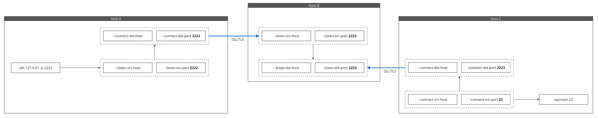

# tcpforwarding



## Creamos certificado

Crear archivo 'openssl.cnf'
```bash
[ req ]
default_bits = 2048
distinguished_name = req_distinguished_name
req_extensions = req_ext

[ req_distinguished_name ]
countryName = Country Name (2 letter code)
countryName_default = US
stateOrProvinceName = State or Province Name (full name)
stateOrProvinceName_default = CA
localityName = Locality Name (eg, city)
localityName_default = City
organizationalUnitName = Organizational Unit Name (eg, section)
organizationalUnitName_default = Unit
commonName = Common Name (eg, fully qualified host name)
commonName_default = localhost

[ req_ext ]
subjectAltName = @alt_names

[ alt_names ]
IP.1 = 127.0.0.1
IP.2 = 192.168.0.15
IP.3 = 192.168.0.26
IP.4 = 192.168.0.109
```

- x.109 host_a
- x.15 host_b
- x.26 host_c

```bash
openssl genpkey -algorithm RSA -out key.pem
openssl req -new -x509 -key key.pem -out cert.pem -days 365 -config openssl.cnf
```

## Desplegamos en openshift / kubernates

```yaml
kind: Project
apiVersion: project.openshift.io/v1
metadata:
  name: tcpforwarding
```

```yaml
kind: BuildConfig
apiVersion: build.openshift.io/v1
metadata:
  name: tcpforwarding-git
  namespace: tcpforwarding
  labels:
    app: tcpforwarding-git
    app.kubernetes.io/component: tcpforwarding-git
    app.kubernetes.io/instance: tcpforwarding-git
    app.kubernetes.io/name: tcpforwarding-git
    app.kubernetes.io/part-of: tcpforwarding-git-app
    app.openshift.io/runtime: python
    app.openshift.io/runtime-version: 3.11-ubi8
spec:
  nodeSelector: null
  output:
    to:
      kind: ImageStreamTag
      name: 'tcpforwarding-git:latest'
  resources: {}
  successfulBuildsHistoryLimit: 5
  failedBuildsHistoryLimit: 5
  strategy:
    type: Source
    sourceStrategy:
      from:
        kind: ImageStreamTag
        namespace: openshift
        name: 'python:3.11-ubi8'
  postCommit: {}
  source:
    type: Git
    git:
      uri: 'https://github.com/damianlezcano/tcpforwarding.git'
      ref: ssl
    contextDir: /host_b
  runPolicy: Serial
```

```yaml
kind: Secret
apiVersion: v1
metadata:
  name: oauth
  namespace: tcpforwarding
data:
  cert.pem: LS0tLS1CRUdJTiBDRVJUSUZJQ0FURS0tLS0tCk1JSURKVENDQWcwQ0ZIdjlVaE9JeTRNZjZkSXBrVUVUN3NoMmoyUlZNQTBHQ1NxR1NJYjNEUUVCQ3dVQU1FOHgKQ3pBSkJnTlZCQVlUQWxWVE1Rc3dDUVlEVlFRSURBSkRRVEVOTUFzR0ExVUVCd3dFUTJsMGVURU5NQXNHQTFVRQpDd3dFVlc1cGRERVZNQk1HQTFVRUF3d01NVGt5TGpFMk9DNHdMakkyTUI0WERUSTBNRGd3TmpBek1ERTBObG9YCkRUSTFNRGd3TmpBek1ERTBObG93VHpFTE1Ba0dBMVVFQmhNQ1ZWTXhDekFKQmdOVkJBZ01Ba05CTVEwd0N3WUQKVlFRSERBUkRhWFI1TVEwd0N3WURWUVFMREFSVmJtbDBNUlV3RXdZRFZRUUREQXd4T1RJdU1UWTRMakF1TWpZdwpnZ0VpTUEwR0NTcUdTSWIzRFFFQkFRVUFBNElCRHdBd2dnRUtBb0lCQVFDblBiTW9DN3ZDL0ZuU0Y0QmROc0h4CjZzSTk0ZTJyR1UzMEJidld5TTl4dWtxcVl0MTdvS2JNQldldFk3ZVlnQS9LK3RlMWJQbnVEaEZpaE1NenZxaEsKbmRXWW5qQ1pxZXoyRWhoWllDRE94Nk9zNTdJSUE5U2xNcXJ5TTFjU0hHdUZJeVVSVXVJVU8zTktlalJUai9aQwpwaVJVRFZIZW1IMy9CbVJ5N3lVQnpXcGhUVm9pVGRBejdPaXpOcHBMenFBY0cvMmJneWswU1NmOHNPMGVOcWw4Cmg2KzRHNjB2eDRFUnExejVKcDFHTCt0RUJIQjhjbUpyVEZzZ2Q4RExVa2FXWE1kbWQwbmRYUmt6OFlLbHN6L0gKOW41Z1NwMDdMeGV3Lys4VUVaV24rUUE4RTUwbldXSlVuYU5wWDZMRlNmc3pYMHV4elVwM1RUTE9pcGFUQTJPZApBZ01CQUFFd0RRWUpLb1pJaHZjTkFRRUxCUUFEZ2dFQkFLTHRneG4wS1RabU9OOTNSTTdCNTBLbGlvMEh1OU1aCmpGN1FKZXRRcHZnbW1ZZUh1S1dRZ1NpMmFjM3lDb081TnNkMFYxNm0rOURJaFBTTWRCWUduUE5kY1RqSzVnLzUKS2VtSHBieGxWdHNvN0drcGNCMnpSbU5IS3pacXlDc3o0cytvZWlTTW5jM2pvNmQydlJRVHBlRHQzT0dWak5BcQpVU0dhbWh4WVZJOUZNRGhWcDNLS3R1V0VGUWYzeFBsaXl4bU9QWlgrYThTdnZGeVQ1c3E1ZXZZM0pEKzdYL1k5CmpscHNNWUdmVVhVTGxsUDRUeVpPaG9uVStBeDA3S244cURuRzVtYy9Da2tGOWpNUzk3SzlDUWpOWXhQcFZyVm8KaVlacS9tYUJjQi9pVXlmQi9QWDdFakpiNlpaKzE2TG9OSmgvQkxxVUpwSEduMnkrd01QQkI5cz0KLS0tLS1FTkQgQ0VSVElGSUNBVEUtLS0tLQo=
  key.pem: LS0tLS1CRUdJTiBQUklWQVRFIEtFWS0tLS0tCk1JSUV2QUlCQURBTkJna3Foa2lHOXcwQkFRRUZBQVNDQktZd2dnU2lBZ0VBQW9JQkFRQ25QYk1vQzd2Qy9GblMKRjRCZE5zSHg2c0k5NGUyckdVMzBCYnZXeU05eHVrcXFZdDE3b0tiTUJXZXRZN2VZZ0EvSyt0ZTFiUG51RGhGaQpoTU16dnFoS25kV1luakNacWV6MkVoaFpZQ0RPeDZPczU3SUlBOVNsTXFyeU0xY1NIR3VGSXlVUlV1SVVPM05LCmVqUlRqL1pDcGlSVURWSGVtSDMvQm1SeTd5VUJ6V3BoVFZvaVRkQXo3T2l6TnBwTHpxQWNHLzJiZ3lrMFNTZjgKc08wZU5xbDhoNis0RzYwdng0RVJxMXo1SnAxR0wrdEVCSEI4Y21KclRGc2dkOERMVWthV1hNZG1kMG5kWFJrego4WUtsc3ovSDluNWdTcDA3THhldy8rOFVFWlduK1FBOEU1MG5XV0pVbmFOcFg2TEZTZnN6WDB1eHpVcDNUVExPCmlwYVRBMk9kQWdNQkFBRUNnZ0VBQk1jWU5tbHBab2RmaUljMzJWSGVaZ3NiRy9uM21IYjdXV0NOam5RRHF4L1QKa0wwTXowS1dhVWN4UUV5VU91VFRycXlPVzRZK3VKeUp4aHI5V1ozVmdIWTBXeTBQdmVBVEh5K0NweEQrTnZJUQpuTGlzeHhwVzZaWkNPSE9iaGU2dWFxb0huZEJVbVpmZU1nOCtMZkh6cXRGRXdlcjBmd3V6czhTcXUzYldBNUJmCkUzTnluWkVHWHlRaFlSNm1ENUx6OGFuSGp3bitGblR4ZHlmZHdLdWh2WXZIQ250Zm9sVmFBZzBSOXJ6RytpZDQKNnNTZUJvK2cxaDBNeS80OG9zejZuY0I4ckxybkk4dGxTTWpLbS9WOVdEOEh5aVFxVXcyZ1E2Qy9DV1VGcjdlLwp2Z0k3S3dUaS9WY21mUjVGazdYR3R0T1ZDQUFhVzBEeE1ub3VXdW5HNFFLQmdRRHAvQlUvcHhKVUNSRldMZ3ZxCm40cjFkemRNaWR3cWZyZ0ZZNHJvMWptM00yWVZEaGZDUkZvYWw3NzBqWVVUSGRpK0VYSkhyUkIzL25Hd291dEMKeWQwVWpnREYvSWp3Z0ZtMExXenplU3NPbHFlVXFRODEzc0hXZ200Tml5QngxazlGUWVKWGtHR2NPOEpZRy8yNwpQM0VZZ2d0cFFiU2N0MS94aFBoQ1F1TUpJUUtCZ1FDMitmdDhzRVFTMDFCRm0zd1dLSjgxR3dBMmxJaW9LZU9ZCnA0ZFF2cDdaL2JoWFk4ZXJwdVExcERLZVkyVGViZUJwMXlBZURWWUlyYi83SDVMbXE1dCtCbTVXZ0Q0RHJDMWwKTkxrM1pBaE44VjQ0NVRjSWNCYkxuOW81a29GWlVVZGJGM1VJa250N1JjbnJDZ0ZndEtvWlJRY3lQcmVWUW9CQQpLNXY5OCtHZS9RS0JnRnJGUURrQlIwcnllWmRGSmJwUFNra1BocFJhcHQ2VmFpNHMvNlp6OU0vdFVKeTZhdDBpClJ4SXA3QnBUREZ6dUp6Y1U3WkNBd3ZMSjhyRGpnd0RWN3I0YW1KSTE5YW5YSVBXVTZiOUtNam5tbC94RDJYSzgKaDlYL28xSDl0d2h5YXk0aThQdW5OemEwdUNBV084aDRSQmVOMjM5cHpmYzk3Q3AxdXhsNWVUb0JBb0dBRUR6dgpESW00QU5PdjgvMXdiYWI5T2dGRGE1U1M3Qm1Ma1NpTTRhV0pBMTk0MUlpT1Y3VmYyMExQR3k5RzdGWmo3QUNqCllRZGQ4emM0S2xrSytGMlNWd1RMRmZJYmpzZmczM0ptWFh3TElKK2k5UG1pZ0tVeDRMQTI5WlVDMWFKWTZzU1MKSmtpWm5MNzh4RmNHK0VZUU1sM2wzWmVqUXlPN3JmWXd5Y0N5N1NFQ2dZQnBHQllrRkJNdzVIQTNQRzY4S1FOSApOSlRmMTFSbzFVOXNmdXN2cnE5bWlYcktzaUlQK2dqUlhUZmpHajdmNGpWVU9RTWtnWWtqWWVQb0JrQjUwaVJOCi9wMndxSUwyU2RhcGdmOVFHQ3NqdHQzWGY1cnFET2dKOWlCeWo4MHQwbnRaWU1ZVjJ4ckhrQzMwM29QVjJKRTEKZEwxbmNETi94cm9rRWlJRTJIVW9nQT09Ci0tLS0tRU5EIFBSSVZBVEUgS0VZLS0tLS0K
type: Opaque

```

```yaml
kind: Deployment
apiVersion: apps/v1
metadata:
  name: tcpforwarding-git
  namespace: tcpforwarding
  labels:
    app: tcpforwarding-git
    app.kubernetes.io/component: tcpforwarding-git
    app.kubernetes.io/instance: tcpforwarding-git
    app.kubernetes.io/name: tcpforwarding-git
    app.kubernetes.io/part-of: tcpforwarding-git-app
    app.openshift.io/runtime: python
    app.openshift.io/runtime-version: 3.11-ubi8
spec:
  replicas: 1
  selector:
    matchLabels:
      app: tcpforwarding-git
  template:
    metadata:
      creationTimestamp: null
      labels:
        app: tcpforwarding-git
        deployment: tcpforwarding-git
    spec:
      volumes:
        - name: oauth
          secret:
            secretName: oauth
            defaultMode: 420
      containers:
        - resources: {}
          terminationMessagePath: /dev/termination-log
          name: tcpforwarding-git
          command:
            - python
            - /opt/app-root/src/app.py
          ports:
            - containerPort: 2222
              protocol: TCP
            - containerPort: 2223
              protocol: TCP
          imagePullPolicy: Always
          volumeMounts:
            - name: oauth
              readOnly: true
              mountPath: /certs
          terminationMessagePolicy: File
          image: 'image-registry.openshift-image-registry.svc:5000/tcpforwarding/tcpforwarding-git:latest'
          args:
            - '2222'
            - '2223'
            - /certs/cert.pem
            - /certs/key.pem
      restartPolicy: Always
      terminationGracePeriodSeconds: 30
      dnsPolicy: ClusterFirst
      securityContext: {}
      schedulerName: default-scheduler
  strategy:
    type: RollingUpdate
    rollingUpdate:
      maxUnavailable: 25%
      maxSurge: 25%
  revisionHistoryLimit: 10
  progressDeadlineSeconds: 600
```

```yaml
kind: Service
apiVersion: v1
metadata:
  name: source
  namespace: tcpforwarding
spec:
  ports:
    - name: source-tcp
      protocol: TCP
      port: 2222
      targetPort: 2222
  selector:
    app: tcpforwarding-git
    deployment: tcpforwarding-git
---
kind: Service
apiVersion: v1
metadata:
  name: target
  namespace: tcpforwarding
spec:
  ports:
    - name: target-tcp
      protocol: TCP
      port: 2223
      targetPort: 2223
  selector:
    app: tcpforwarding-git
    deployment: tcpforwarding-git
```


```yaml
kind: Route
apiVersion: route.openshift.io/v1
metadata:
  name: source
  namespace: tcpforwarding
spec:
  host: source-tcpforwarding.apps.kali.rlab.sh
  to:
    kind: Service
    name: source
    weight: 100
  port:
    targetPort: source-tcp
  tls:
    termination: passthrough
    insecureEdgeTerminationPolicy: None
  wildcardPolicy: None
---
kind: Route
apiVersion: route.openshift.io/v1
metadata:
  name: target
  namespace: tcpforwarding
spec:
  host: target-tcpforwarding.apps.kali.rlab.sh
  to:
    kind: Service
    name: target
    weight: 100
  port:
    targetPort: target-tcp
  tls:
    termination: passthrough
    insecureEdgeTerminationPolicy: None
  wildcardPolicy: None
```